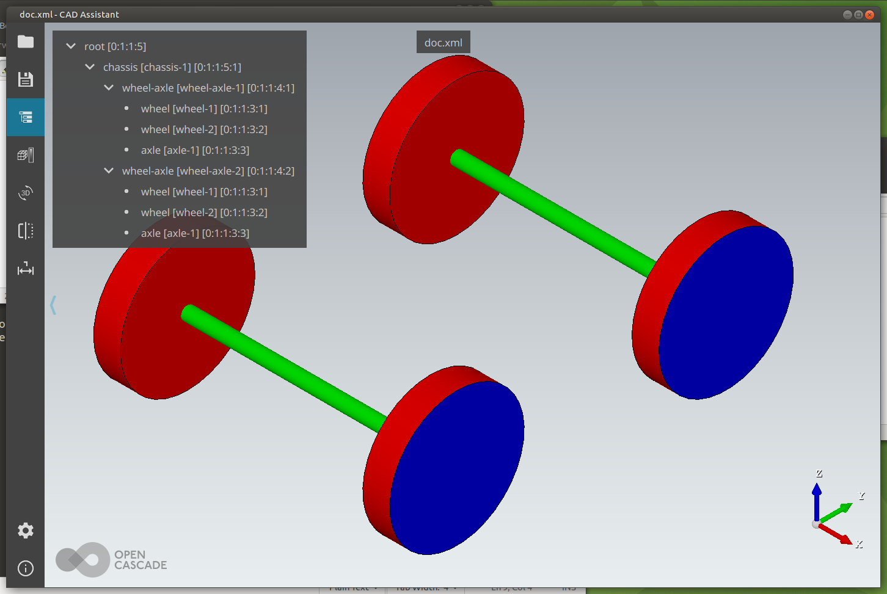

# Lesson15_plus_root

## Second in a series of OpenCascade C++ examples

* This example composes a step file like the one used in [Quaoar's Workshop Lesson 12](https://www.youtube.com/watch?v=NMs7GtvsJ6g&list=PL_WFkJrQIY2iVVchOPhl77xl432jeNYfQ&index=10&t=575s) in which the chassis assembly is a child of a top level `root` assembly.

* Modified to work on Ubuntu (Display related code removed because it only runs on Windows)

* and converted to Python

### This code is based on the code in the project `Lesson15` but places the resulting CAD assembly under a **root** level.

* It composes a document capable of being displayed and saves the document to file `doc.xml`

* The document is then converted to step format and saved as `chassis.step`

* Both files can be opened using CAD Assistant

* A copy of the equivalent C++ file `main.cpp` is included in this folder for handy reference.

