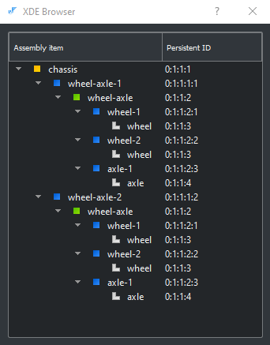

# PythonOCC version of Quaoar's Workshop [Lesson 15: Export OpenCascade assemblies to STEP](https://www.youtube.com/watch?v=dq2-evewPeA&list=PL_WFkJrQIY2iVVchOPhl77xl432jeNYfQ&index=7)

* This video is one in a series of [Open Cascade Lessons](https://www.youtube.com/playlist?list=PL_WFkJrQIY2iVVchOPhl77xl432jeNYfQ)
* It shows how to compose a chassis assembly and save it in multiple formats:

* Here is the DFBrowse view of the document produced in this Lesson
    * `doc.xml` containing the composed document
    * `chassis.stp` containing the result of conversion of the document to step format

* Both files can be opened in CAD Assistant.

* Notice that the composed document shows the top assembly with the highest value of tag (label entry value = `0:1:1:4`


* Whereas the step file has the top assembly with the label entry value = `0:1:1:1`


* Apparently, this was needed in order to maintain compliance with the step format requirements.

* Further exploration has shown that using `shape_tool.UpdateAssemblies()` doesn't have any effect on this.

* So far, the only way I have discovered that will cause these label entry values to get reordered is by saving in step format.

* If the step file is then reloaded, the label entry values in the document will be reordered with the root level assembly having the lowest label entry values.

## Using OpenCascade Draw to explore the details of the document

* OpenCascade Draw has the ability to load either:
    * a step file
    * or a saved document in .xbf or .xml format
* and can be used to examine the saved document:
```
pload ALL
Open C:/Users/doug/Desktop/step_files/chassis.xbf doc
DFBrowse doc
```


## Analysis Situs has a similar tool

* By entering the following into the Analysis Situs command window:
```
asm-xde-new -model M
asm-xde-load -model M -filename C:/Users/doug/step-files/chassis.stp
asm-xde-dfbrowse -model M
```
* And by entering the following into the Draw command window:
```
pload ALL
Open C:/Users/doug/step_files/chassis.stp doc
DFBrowse doc
```
* We can get a side-by-side comparison of the two browsers:
* Unfortunately, both browsers only work under Windows. Neither works under linux.
* I think the AS browser seems a bit easier to read with its colored icons
* On the other hand, it is occasionally useful to be able to read a document. Only Draw can do this.

Analysis Situs: asm-xde-dfbrowse chassis.stp | Draw: DFBrowse chassis.stp
------------------- | ---------------------------
 | 

# Both OpenCascade Draw and Analysis Situs provide tools for display of the assembly hierarchy as well

```
asm-xde-new -model M
asm-xde-load -model M -filename C:/Users/doug/step-files/chassis.stp
asm-xde-browse -model M
```
This produces the display below, showing the hierarchical structure of the file `chassis.stp`



