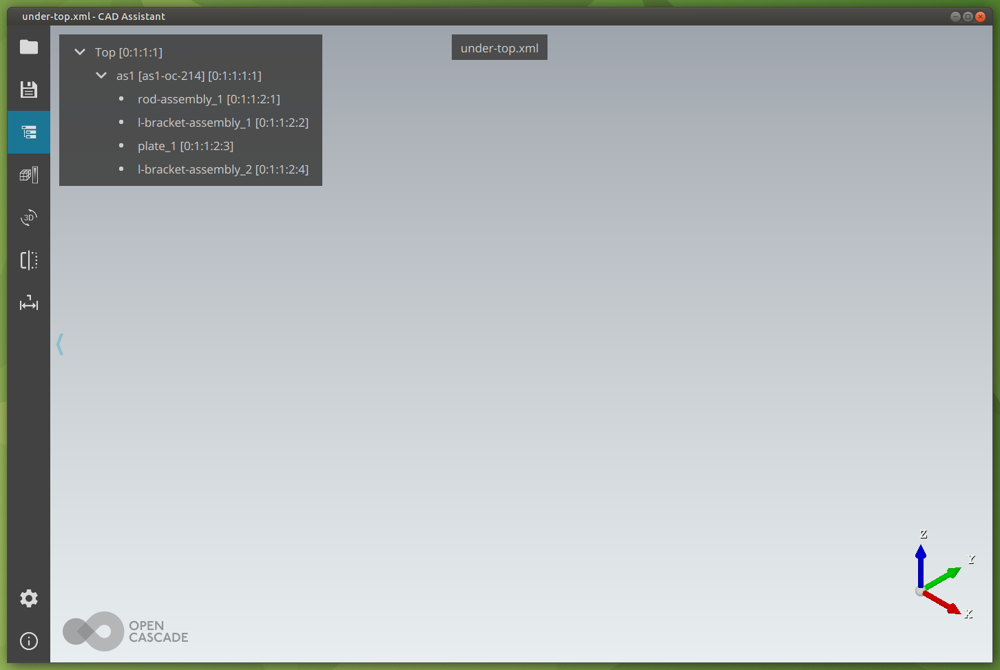
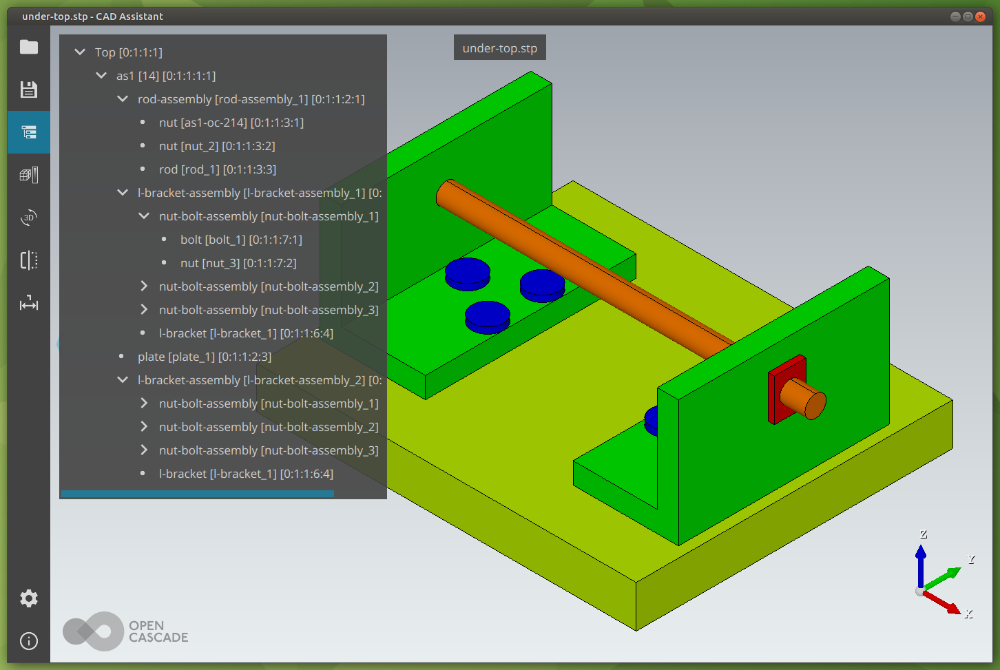

# Lesson15_under_top

## Third in a series of OpenCascade C++ examples

* This example loads a step file `as1-oc-214.stp` as a component of a top level `root` assembly.

* It was first written in Python.
* It produces 2 files:
    * `under-top.xml` which contains the document resulting from loading the file under a root level assembly
    * `under-top.stp` which is a result of transferring the document to the step writer then writing the step file.

* Below are the results of loading each of those file in CAD ASSistant.

* Clearly, the document isn't right. It's not complete and it's not enough for CAD Assistant to render it.
* However, Open Cascade is able to generate what seems to be a correct STEP file.
* One way to repair the document would be to go through a save/load cycle:
    * Save the doc to a temporary step file
    * Reload the step file and replace the defective document with the newly generated one.
* My suspicion is that there is an error in the way my code works.
* I believe the OpenCascade C++ communitiy is larger and more active than the PyOCC community, so I may be more likely to discover the problem if I post the question to a C++ forum.
* Therefore, my next step is to write the equivalent C++ code.

