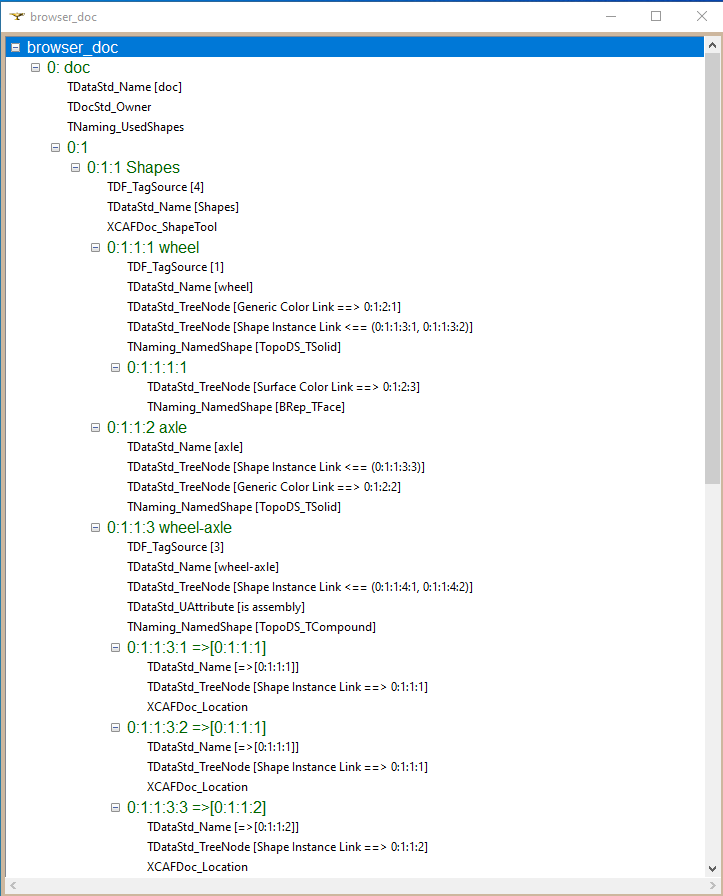
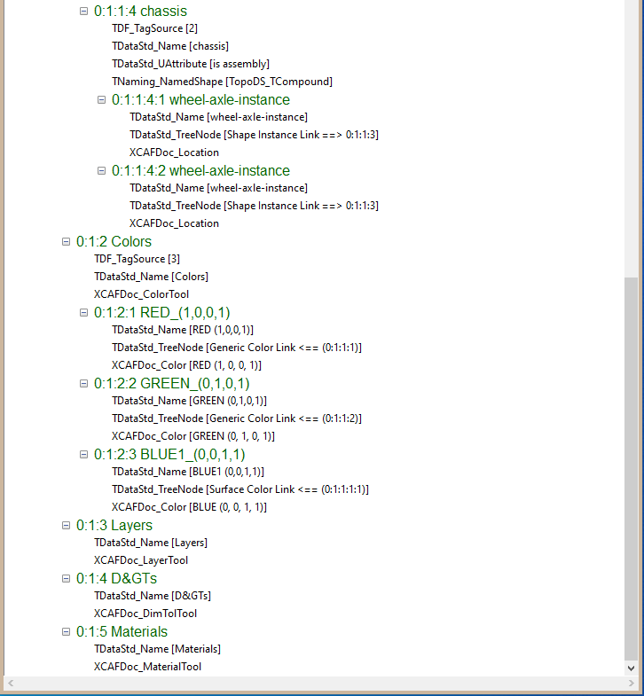

# PythonOCC version of Quaoar's Workshop [Lesson 15: Export OpenCascade assemblies to STEP](https://www.youtube.com/watch?v=dq2-evewPeA&list=PL_WFkJrQIY2iVVchOPhl77xl432jeNYfQ&index=7)

* This video is one in a series of [Open Cascade Lessons](https://www.youtube.com/playlist?list=PL_WFkJrQIY2iVVchOPhl77xl432jeNYfQ)

* Here is the DFBrowse view of the document produced in this Lesson

